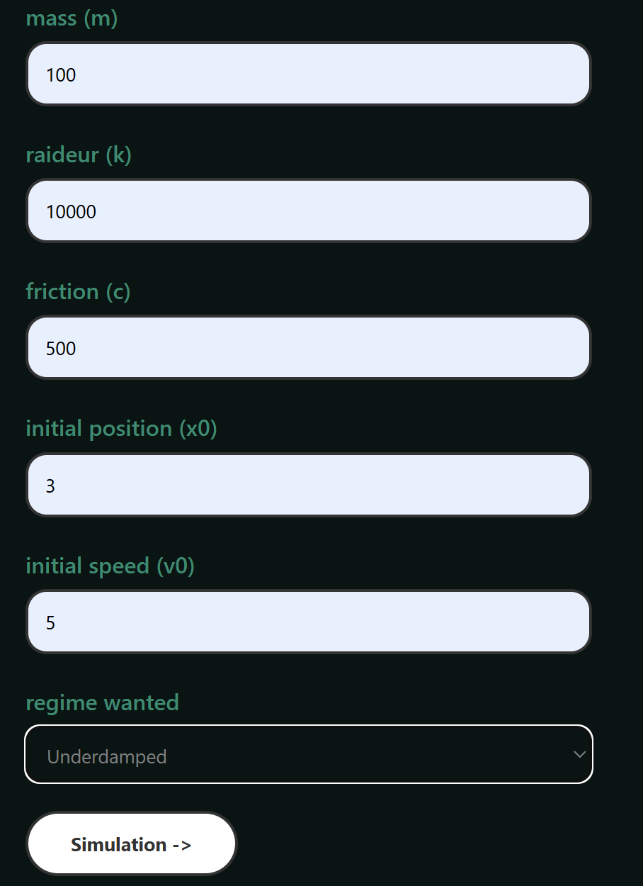
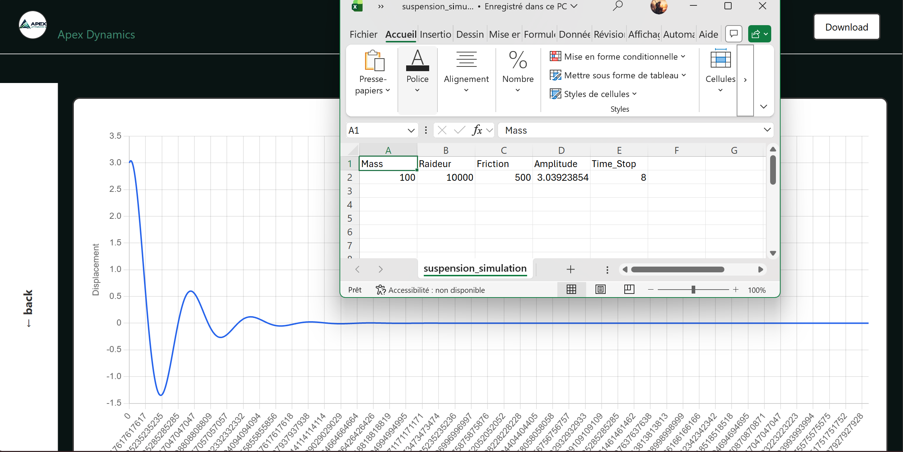

# Apex Dynamics: Vehicle Suspension Simulator & Parameter Optimizer

[](https://www.python.org/)
[](https://fastapi.tiangolo.com/)
[](https://developer.mozilla.org/)
[](LICENSE)

An interactive full-stack telemetry and simulation engine engineered to model quarter-car suspension dynamics, search for valid physical parameters across underdamped, critically damped, and overdamped regimes, and export numerical analyses to CSV.

---

## 📸 Interface & Previews

<div align="center">
  
  
</div>

---

## 🚀 Key Features

* **Dynamic Parameter Solver:** Leaves missing physical parameters (mass $m$, stiffness $k$, damping $c$) unspecified and automatically searches configured ranges for valid regime configurations.
* **Physics Simulation Engine:** Solves second-order linear differential equations modeling spring-damper dynamics across three regimes:
    * `sous` (Underdamped)
    * `critique` (Critically Damped)
    * `sur` (Overdamped)
* **Real-Time Data Visualization:** Serves computed time-domain displacement and velocity vectors directly to a dynamic browser-based UI.
* **Analytical CSV Export:** Calculates damping amplitudes and settle times across parameter combinations for offline processing.

---

## 🛠️ System Architecture & Tech Stack

* **Frontend:** HTML5, CSS3, JavaScript (Fetch API, Chart.js)
* **Backend:** FastAPI, Pydantic, Uvicorn
* **Data Processing:** NumPy, SciPy, Pandas

---

## 💻 Local Setup & Execution

### Prerequisites
* Python 3.10+ installed

### 1. Clone & Set Up Environment

```bash
git clone [https://github.com/Palmaf0x/Suspension_Simulation.git](https://github.com/Palmaf0x/Suspension_Simulation.git)
cd Suspension_Simulation

# Create and activate virtual environment
python -m venv .venv

# On Linux/macOS:
source .venv/bin/activate
# On Windows (PowerShell):
# .venv\Scripts\Activate.ps1